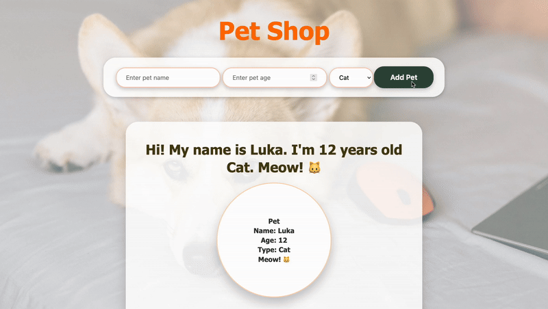

# 🐾 PHP Pet Shop

A simple PHP site where users can add pets by their name, age and type. Each pet is saved in the session and displayed on the page with a greeting and an animal emoji. 

____

## 🛠️ Tech Stack
* HTML  
* CSS  
* PHP  

---

## 🚀 Preview

  

Watch Full Demo on YouTube <a href="https://youtu.be/EXoIIKUmqU0"> Here!
</a>
